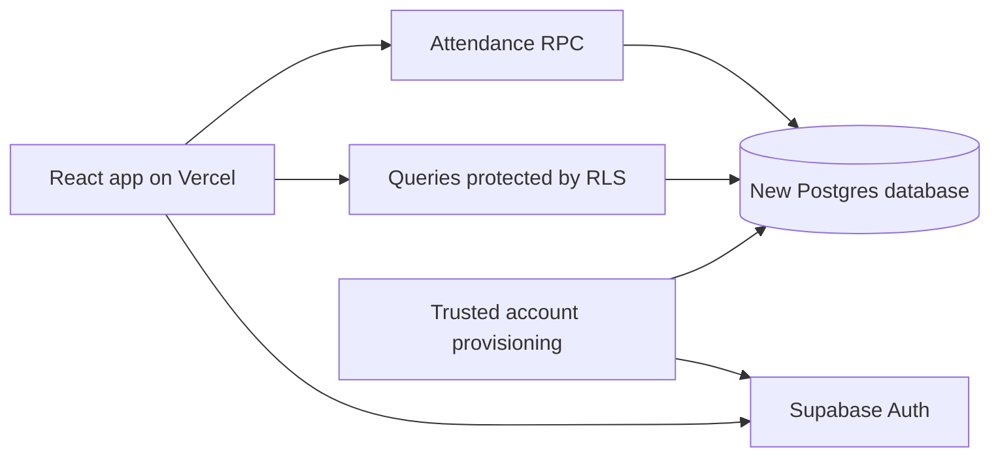

# Clock-in ECIC: build-from-scratch plan for an AI agent

Prepared: 2026-09-11. Project: `clock-in-ecic`.

Implementation update (2026-09-12): the new brief and local application/schema/operator tooling are implemented. See [PRODUCT_BRIEF.md](PRODUCT_BRIEF.md), [DATABASE.md](DATABASE.md), [SETUP.md](SETUP.md), and [VERIFICATION.md](VERIFICATION.md) for actual decisions, results and remaining launch gates. The original phase checklist below is retained as the planning reference; it is not a claim that cloud launch is complete.

## 1. Objective and confirmed scope

Build a new teacher attendance application in the existing React + TypeScript + Vite starter, with a newly designed Supabase database and a fresh Vercel project.

The user changed direction: this is a new product build. The previous application does not define the required features, UI, routes, business rules, schema, or acceptance tests. Do not port its code or import its accounts, passwords, attendance, or database objects. Keep `teacher-attendance-web` and its existing working-tree changes untouched. Its cloud resources are relevant only to the separate retirement procedure.

Confirmed choices:

- Build in `clock-in-ecic` using Vite, React and TypeScript.
- Design a new Supabase backend and start with empty operational data and freshly provisioned users.
- Create a fresh Vercel project for the new app.
- Keep retirement of the old cloud resources in [SUPABASE_VERCEL_RESET.md](SUPABASE_VERCEL_RESET.md).

Everything below concerning product behavior is a **proposed starting point**, not a requirement inherited from the old application. This document plans future work; preparing it does not implement the app or authorize cloud deletion.

## 2. Establish the new product brief

Before implementing business-dependent behavior, record the new app's brief in `docs/PRODUCT_BRIEF.md`. Use the user's new requirements as the authority. Ask only for unresolved decisions that materially change the build, and continue independent project setup while answers are pending. Do not look up old source code to fill in missing product decisions.

| Decision | Proposed starting point | What must be settled |
| --- | --- | --- |
| Users and permissions | Teachers record their own attendance; admins review reports | Whether admins also record attendance, provision accounts, or correct records |
| Login | Supabase Auth with administrator-provisioned accounts | Email versus cédula login; password recovery and account lifecycle |
| Attendance capture | Scan a school QR | Static versus rotating QR, or a different registration method; required presence assurance |
| School time | `America/Guayaquil` | Actual timezone, working days, holidays and overnight behavior |
| Attendance rules | Server-authorized entry and exit | One pair or multiple pairs per day; opening/closing times; lateness and justification |
| Teacher experience | Current status and personal history | Required details, date filters and terminology |
| Admin experience | Daily report and teacher/date filters | Required totals, absence rules, corrections and export format |
| Interface | Spanish, responsive and keyboard accessible | Branding, visual direction and required device support |
| Installation/offline | Online attendance submission only | Whether installable PWA support is part of the first release |

Do not seed the old 06:00/06:40/12:40/13:00 schedule, reuse the old QR payload, assume cédula-based synthetic email identities, copy report columns, or reproduce old routes simply because they existed. Select those details from the new brief.

Proposed first release: authentication, authorized attendance capture, personal history and a basic admin report. Treat XLSX export, installable PWA support, account-management screens and manual corrections as separate scope decisions. Defer payroll, multiple schools and complex shift scheduling unless requested.

Gate: the brief states the actual first-release scope, role permissions and attendance rules. Any unresolved item is labeled; it must not silently become a production default.

## 3. Architecture

Use a static React SPA on Vercel, Supabase Auth, and Postgres with Row Level Security. Attendance writes go through a checked database function so enforcement does not depend on browser code. Use a single typed Supabase browser client, a client router, and a small data-access layer. Browser route guards improve navigation; database permissions protect the data. [Supabase React integration](https://supabase.com/docs/guides/getting-started/quickstarts/reactjs), [RLS](https://supabase.com/docs/guides/database/postgres/row-level-security).



Use `VITE_SUPABASE_URL` and `VITE_SUPABASE_PUBLISHABLE_KEY` for public browser configuration. Validate missing settings before creating the client. Keep secret/service-role keys, database passwords and management tokens outside the frontend. Vite embeds `VITE_*` variables in client assets. [Vite environment variables](https://vite.dev/guide/env-and-mode).

Suggested structure, created as features need it:

```text
src/
  app/                 router, providers, guards, shell
  features/auth/       login and session lifecycle
  features/attendance/ capture UI and current state
  features/history/    personal records
  features/admin/      reports and approved admin actions
  components/          shared UI
  lib/                 client, dates, errors, data access
  types/database.ts    generated Supabase types
supabase/
  config.toml
  migrations/          versioned SQL for the new database
  tests/               database tests
  seed.sql             approved nonpersonal school configuration
scripts/               trusted provisioning and connection check
tests/                 domain and browser tests
docs/                  product brief, schema/API contract, setup
vercel.json            SPA fallback
```

Database “migrations” here mean versioned SQL changes for the new database, not migration of the old application.

## 4. Proposed data model

Finalize columns and constraints after the brief. Prefer a small relational model with clear ownership; do not copy the old tables or build a generic multitenant framework.

| Entity | Suggested fields | Responsibility |
| --- | --- | --- |
| `profiles` | Stable application UUID, nullable unique Auth user link, name, trusted role, active flag, timestamps | Identity and access; unlinking login should not erase historical attendance |
| `teachers` | Profile FK, employee identifier, employment start/end dates | Teacher-specific data and historical report eligibility |
| `attendance_policies` | Version UUID, effective date range, timezone, approved schedule/rules | Applicable attendance rules; retain old versions for historical interpretation |
| `checkpoints` (if QR capture is selected) | UUID, code, label, active flag | Registration location; keep validation tokens in a private table |
| `attendance_events` | UUID, teacher FK, policy FK, checkpoint FK if applicable, event type, server timestamp/local date, daily sequence, request UUID, optional justification | Authoritative event history and retry protection |

Design requirements:

- Use foreign keys, required-field constraints, unique identifiers and indexes matched to actual queries.
- Decouple stable teacher identity from Auth account deletion; preserve history and disable access independently.
- Roles and activation must be controlled by trusted administration. User-editable metadata must not grant privileges.
- If cédula login is selected, store cédulas as text with the approved validation rule and define a trusted Auth-identity mapping. Specify recovery before provisioning users.
- Use `timestamptz` and server-derived school dates. Clients cannot assign attendance timestamps, teacher IDs or policy versions.
- Version schedule rules used by recorded events; avoid overlapping effective ranges. Add only rules required by the brief.
- Add unique `(teacher_id, request_id)` and `(teacher_id, school_date, sequence_no)` constraints for replay and event ordering. If the brief permits only one pair per day, enforce that separately.
- Derive daily summaries from authoritative events. Define complete/incomplete/absent and worked time precisely, including unmatched entries and employment dates.
- Keep production seeds limited to approved school configuration. No real users, passwords or attendance fixtures in committed SQL.

Write `docs/DATABASE.md` describing finalized tables, constraints, deletion behavior, permissions and RPC contracts. Generate TypeScript types from the implemented schema.

## 5. Authorization and attendance transaction

Enable RLS on exposed tables, revoke unnecessary grants and test direct API calls. Teachers may read only their authorized records. Admin access must match the product brief. Keep direct browser attendance writes disabled; approved corrections, if any, require a separate audited transaction. Harden privileged functions with qualified names, a fixed/empty search path, explicit caller checks and restricted execution grants. [Supabase database functions](https://supabase.com/docs/guides/database/functions).

Proposed attendance RPC inputs: captured QR payload if applicable, expected action/local date/prior sequence, request UUID, and any required justification. It must:

1. Resolve the authenticated user to an enabled profile with permission to register.
2. Acquire a per-teacher lock to serialize simultaneous submissions.
3. Check for an already committed request UUID. Return its original event for an exact replay; reject reuse with different arguments. A retry must not advance attendance state again.
4. Read one server timestamp after locking, resolve the applicable policy and validate the expected date/state.
5. Validate the capture method, checkpoint and approved business rules on the server.
6. Insert one event atomically with server-controlled fields and the next sequence.
7. Return a typed result or stable error code for the UI.

Return server time/current state through a context query for display, while rechecking everything during writes. A static QR, if chosen, is copyable; do not describe it as proof of physical presence.

Use a new request UUID for each deliberate action and retain the same arguments/UUID when reconciling an uncertain response. Do not queue offline attendance. Clear user-specific cached data and pending requests at logout/account change.

For reports, apply authorization, input validation, stable pagination and bounded page sizes. Compute filtered totals before pagination. If export is approved, export all matching rows through bounded queries and a consistent report boundary; preserve identifiers as text and prevent user text from becoming spreadsheet formulas.

## 6. Implementation phases

### Phase A — brief and project foundation

- [ ] Establish `docs/PRODUCT_BRIEF.md` using section 2.
- [ ] Read applicable `AGENTS.md` and inspect `clock-in-ecic` status. Leave sibling projects untouched.
- [ ] Check the starter's lint/build baseline; select and record a supported Node version compatible with its installed Vite toolchain.
- [ ] Keep the existing React/Tailwind Vite setup. Replace starter content with the new design as it is implemented.
- [ ] Add only dependencies required by the brief, checking their current official documentation. Commit a lockfile.
- [ ] Add `typecheck`, `test`, `test:e2e` and read-only `check:connection` scripts; initialize local Supabase CLI configuration and placeholder `.env.example`.

Gate: a documented brief and reproducible project foundation; no copied legacy implementation.

### Phase B — schema and backend

- [ ] Implement the new model, constraints, permissions, account lifecycle and required RPCs in ordered SQL migrations.
- [ ] Write local database tests for roles, isolation, business rules, concurrency and request replay.
- [ ] Build trusted provisioning with inactive-first creation and safe recovery from partially completed setup. Keep administrative credentials outside browser imports.
- [ ] Generate database types and document RPC inputs, returns and errors.
- [ ] Recreate the disposable local database from scratch and pass its tests.

Gate: the backend enforces the agreed rules even when the frontend is bypassed.

### Phase C — new interface and core workflows

- [ ] Design and implement the new responsive app shell, routes and accessible loading/empty/error states.
- [ ] Implement the selected login/recovery workflow, session restoration, role routing, refresh cleanup and logout.
- [ ] Build the selected capture experience with explicit pending/success/failure states, no double submission, and uncertain-result reconciliation.
- [ ] If camera capture is selected, handle permission failures and stop camera tracks on completion/navigation, including React development effect cleanup.
- [ ] Implement personal history and current state with validated filters and deterministic pagination.

Gate: authorized users can complete the agreed attendance workflow, and account switching cannot reveal another user's data.

### Phase D — reports and approved extras

- [ ] Implement the approved admin report and totals using the same backend aggregation contract.
- [ ] Implement export, corrections, provisioning screens or PWA features only if the brief includes them.
- [ ] For an approved PWA, create fresh manifest/icons/offline handling; cache no private responses and queue no attendance offline.

Gate: report results agree with stored events across full datasets and all approved extras have acceptance coverage.

### Phase E — verify and launch

- [ ] Run type checks, lint, domain tests, database tests, production build and browser tests.
- [ ] Configure Vercel SPA fallback and verify chosen routes through direct navigation/refresh plus static asset responses.
- [ ] Run hosted HTTPS and physical-device tests required by the chosen capture method.
- [ ] Complete [SUPABASE_VERCEL_RESET.md](SUPABASE_VERCEL_RESET.md) when cloud actions are authorized. Retirement is an operational step, not a requirement to reproduce the old product.
- [ ] Document installation, configuration, account provisioning/recovery, rules, backup operations and actual deployment URL.

Gate: the new product meets its own brief on the new backend and Vercel project.

## 7. Verification and handoff

| Layer | Required evidence |
| --- | --- |
| Database | Fresh schema rebuild; cross-user isolation; role spoofing denied; inactive access denied; retained history after login removal |
| Attendance | Agreed state transitions and time boundaries; concurrent devices; lost-response replay; changed-payload replay rejected; no client clock override |
| Reporting | Global totals independent of page; missing events; employment dates; data beyond API row limits; approved export matches report |
| Browser | Session lifecycle; role routing; account cache clearing; accessible mobile layouts; actual capture error states |
| Hosted | HTTPS; direct route refresh; correct assets; only new Supabase connections; no secret in frontend assets |

Test time-dependent rules with deterministic local fixtures or private test helpers. Never add a production RPC parameter that lets a client override server time. Use disposable test accounts and bounded cleanup for any hosted write tests.

After the scripts are implemented, run `npm run typecheck`, `npm run lint`, `npm test`, `npm run build`, local `npx supabase test db`, and `npm run test:e2e` against a production preview. Report physical-device checks separately when they require operator participation.

Definition of done: the agreed product brief is implemented, database and application checks pass, fresh setup is reproducible, operational instructions are complete, and cloud outcomes are reported only when actually observed. No comparison with the old application's feature list is a completion requirement.

Suggested agent instruction:

> Build `clock-in-ecic` from scratch using `docs/BUILD_PLAN.md`. Establish the new product brief, then implement the schema, backend, interface and verification phases. Do not port the sibling Next.js app or treat its behavior as requirements. Preserve sibling working trees. Use a fresh Supabase project and fresh Vercel project; follow the separate reset guide for authorized infrastructure actions.
